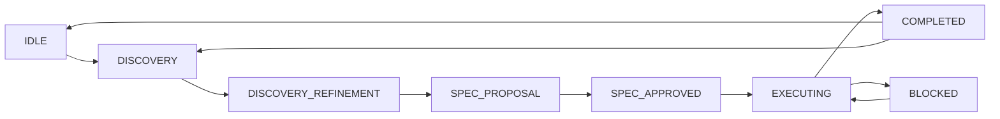
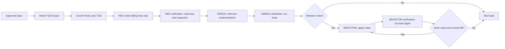
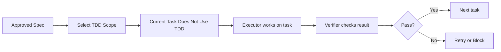

# tddmaster

`tddmaster` is a Go CLI that acts like a scrum master for AI coding agents.

Its job is to keep long-running implementation work from collapsing into context rot: unclear scope, forgotten edge cases, hand-wavy verification, and "the agent kind of drifted into something else". Instead of letting an agent freestyle across a repo, `tddmaster` forces work through a state machine: discovery, spec generation, approval, execution, verification, and completion.

This project is closely related to [`github.com/eser/stack`](https://github.com/eser/stack). The main project there is centered around `noskills`; `tddmaster` takes that orchestration idea, implements it in Go, and specializes it for TDD-first execution.

## Why this exists

AI agents do noticeably worse when:

- the scope is implicit
- the success criteria are vague
- edge cases are mentioned once and then forgotten
- the task grows while the context window gets noisier
- the agent is allowed to self-approve weak work

`tddmaster` tries to fix that by enforcing a smaller loop:

- discovery questions extract the real job
- the answers are turned into a concrete spec
- tasks, verification steps, and out-of-scope boundaries are written down
- the execution loop keeps feeding the agent only the context for the current phase
- verification is explicit instead of implied
- TDD can be applied to all tasks, no tasks, or only the tasks that actually benefit from it

The result is not "more process for its own sake". The point is better agent output under long or complex tasks.

## What it does

At a high level, `tddmaster`:

- initializes a `.tddmaster/` workspace inside your repo
- detects supported coding tools and syncs instructions/hooks for them
- asks structured discovery questions before implementation starts
- generates a spec with tasks, verification steps, out-of-scope items, and edge cases
- routes the work through a phase-based state machine
- supports both TDD and non-TDD execution paths
- records decisions, progress, verification failures, and revisit history

Supported tool integration in this repo includes:

- Claude Code
- OpenCode
- Codex CLI

## Core idea: fight context rot

The project is opinionated about one thing: an agent should not hold the whole project in its head all the time.

Instead, `tddmaster` keeps a durable working memory on disk and recompiles only the context needed for the current phase. In practice that means:

- discovery answers are persisted
- generated `spec.md` is the shared execution contract
- `progress.json` tracks task state
- phase-specific instructions are compiled for the active step
- hooks and synced agent files push those rules into the coding tool

That is the "scrum master" behavior: keep the work bounded, keep the user in control of decisions, and keep the implementation loop honest.

## State machine

The main workflow is a state machine, not an open-ended chat.



What each phase is for:

- `IDLE`: no active spec
- `DISCOVERY`: gather requirements and pressure-test assumptions
- `DISCOVERY_REFINEMENT`: synthesize, challenge, and refine the discovery output
- `SPEC_PROPOSAL`: review the generated spec
- `SPEC_APPROVED`: final gate before work starts
- `EXECUTING`: run the actual task loop
- `BLOCKED`: explicit stop when the agent cannot continue safely
- `COMPLETED`: done, cancelled, or wontfix

## Discovery flow

The discovery layer is where `tddmaster` tries to get ahead of bad implementation.

Built-in discovery questions currently cover:

- `status_quo`: what users do today
- `ambition`: the 1-star version versus the 10-star version
- `reversibility`: whether the change is a one-way door
- `user_impact`: whether current behavior changes
- `verification`: how correctness will be proven
- `scope_boundary`: what the feature must not do
- `edge_cases`: which exceptional conditions need defensive tests

The system can also:

- inject concern-specific follow-up prompts
- ask for discovery mode upfront (`full`, `validate`, `technical-depth`, `ship-fast`, `explore`)
- challenge the premises before continuing
- require follow-ups to be answered before discovery completes
- detect when a spec should potentially be split into multiple work areas

## Generated spec shape

Discovery is turned into a real spec, not a chat summary.

Generated specs include:

- discovery answers
- concern-driven sections
- decisions
- out-of-scope items
- edge cases
- tasks
- verification checklist
- custom acceptance criteria
- notes
- transition history

This matters because the agent is no longer implementing against a vague paragraph. It is implementing against an explicit artifact.

## TDD flow

TDD is a first-class execution mode, not a note in the README.

At initialization, the project can enable TDD mode. Later, once a spec is approved, the user can choose:

- TDD for all tasks
- no TDD for any task
- custom TDD selection per task

This is important because not every task deserves red-green-refactor. Pure scaffolding or dependency plumbing often does not.

### TDD execution flow



What that means in practice:

- `red`: tests first, no production code
- red verification is read-only and checks test quality/coverage shape
- `green`: implement the minimum needed to make the tests pass
- green verification runs the suite and can emit refactor notes
- `refactor`: apply cleanup without changing behavior
- refactor verification reruns tests and may continue for another round or stop

If verification keeps failing, the workflow can auto-block after the configured retry limit.

## Non-TDD flow

Non-TDD execution is still structured. It simply skips the red-green-refactor cycle.



This path is useful for tasks like:

- bootstrapping
- module/dependency setup
- CI wiring
- repository scaffolding
- command or directory creation

The point is not "always use TDD". The point is "use TDD where it improves outcomes".

## Edge case handling

Edge cases are treated as first-class planning inputs, not as a final checklist item.

`tddmaster` derives edge cases from multiple sources:

- literal entries in the explicit `edge_cases` answer
- other discovery answers that contain boundary/error/risk language
- premise revisions and disagreements discovered during review

The extraction rules intentionally look for signals like:

- empty or zero states
- missing or invalid input
- duplicate data
- timeout, retry, offline, partial failure
- concurrency or race conditions
- large input, long text, whitespace, unicode, null/nil cases

The behavior is:

- explicit `edge_cases` answers are taken literally and listed first
- other answers are scanned for edge-case candidates
- duplicates are removed while keeping first-seen order
- the final set is written into `spec.md`

During execution, tasks can optionally declare which edge cases they cover via `Covers: EC-1, EC-2`. When that mapping exists, the current task only receives the relevant subset instead of the full edge-case list.

This is one of the main ways the project resists context rot: risk does not disappear after discovery. It stays attached to execution.

## Why the output is usually better

The quality improvement comes from structure, not magic.

- The user is forced to say what success looks like.
- The agent gets an explicit out-of-scope boundary.
- Verification is written before "done".
- Edge cases are persisted and carried into execution.
- Specs can be revisited instead of thrown away.
- TDD is applied where it creates signal, skipped where it only adds ceremony.
- Tool sync injects the same workflow into the coding environment instead of relying on memory.

In short: less drift, less fake certainty, better verification.

## Quick start

Install:

```bash
go install github.com/pragmataW/tddmaster@latest
```

Initialize a repository:

```bash
tddmaster init
```

Create a spec:

```bash
tddmaster spec new add-oauth-device-flow "Add OAuth device flow to the CLI"
```

Start discovery:

```bash
tddmaster spec add-oauth-device-flow next
```

Approve the generated spec:

```bash
tddmaster spec add-oauth-device-flow approve
```

Start execution:

```bash
tddmaster spec add-oauth-device-flow next --answer="start"
```

Complete the spec:

```bash
tddmaster spec add-oauth-device-flow done
```

Useful supporting commands:

- `tddmaster status`
- `tddmaster watch`
- `tddmaster run --spec=<name>`
- `tddmaster rule add "..."` 

## Repository artifacts

Important generated files:

- `.tddmaster/manifest.yml`: project-level configuration
- `.tddmaster/.state/state.json`: active state machine snapshot
- `.tddmaster/specs/<spec>/spec.md`: execution contract for a spec
- `.tddmaster/specs/<spec>/progress.json`: task/progress state

## Development

Run the test suite:

```bash
go test ./...
```

## Releases

This repository includes GoReleaser configuration for GitHub releases. Once tags are pushed, binaries can be published for `tddmaster` and installed through the Go toolchain.
