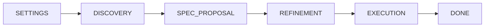
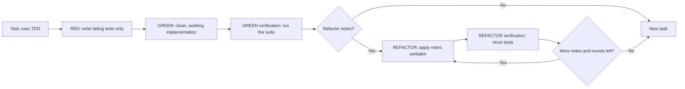
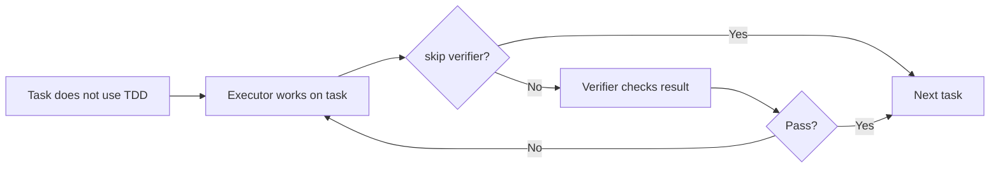

# tddmaster

`tddmaster` is a Go CLI that acts like a scrum master for AI coding agents.

Its job is to keep long-running implementation work from collapsing into context rot: unclear scope, forgotten edge cases, hand-wavy verification, and "the agent kind of drifted into something else". Instead of letting an agent freestyle across a repo, `tddmaster` forces work through a phase-based engine: discovery, spec proposal, refinement, and execution — with verification wired in at every step.

This is a ground-up refactor of the original `tddmaster`. The whole orchestrator now runs on a single deterministic engine: phases compose modules, modules compose steps, and the execution loop is a small ruleset of stages. The agent never freelances the workflow — it asks the engine `next` and does exactly what comes back.

## Why this exists

AI agents do noticeably worse when:

- the scope is implicit
- the success criteria are vague
- edge cases are mentioned once and then forgotten
- the task grows while the context window gets noisier
- the agent is allowed to self-approve weak work

`tddmaster` tries to fix that by enforcing a smaller loop:

- discovery questions extract the real job
- the answers are turned into a concrete spec
- tasks, acceptance criteria, edge cases, and out-of-scope boundaries are written down
- the execution loop feeds the agent only the context for the current stage
- verification is explicit instead of implied
- TDD can be applied to all tasks, no tasks, or only the tasks that actually benefit from it

The result is not "more process for its own sake". The point is better agent output under long or complex tasks.

## The master loop

There is exactly one command the driving agent calls in a loop: `tddmaster next <slug>`.

Every call returns a JSON `Action` object. The agent acts on it, then calls `next` again — passing its result back with `--answer` when the action asked for one.

```jsonc
{
  "action": "ask | instruct | notify | terminal | error",
  "instruction": "...",
  "delegateAgent": "tddmaster-executor | tddmaster-planner | tddmaster-test-writer | tddmaster-verifier",
  "expectedInput": {
    "format": "json | text | flag",
    "submitCmd": "tddmaster next <slug> --answer='...'",
    "example": "..."
  },
  "interactiveOptions": [{ "label": "...", "description": "..." }],
  "commandMap": { "label": "tddmaster next <slug> --answer='...'" },
  "multiSelect": false
}
```

Everything the agent needs is in that JSON. It drives off the action type, never off its own guesses:

- `ask` — present the question (or delegate to `delegateAgent`); submit the answer via `--answer`
- `instruct` — spawn the named sub-agent with `instruction`; submit its status report
- `notify` — display to the user; call `next` again with no answer
- `terminal` — spec is complete or cancelled; stop the loop
- `error` — surface the error; do not advance

## Engine model

The workflow is a deterministic state machine, not an open-ended chat. It is built from three nested pieces:

- **Phase** — a major stage of the spec lifecycle, backed by a `Driver`
- **Module** — a group of steps inside a phase
- **Step** — a single ask/submit exchange

Most phases use a generic step-table driver. The execution phase uses a dedicated loop driver whose behavior is a small, ordered **ruleset** of stages — the first stage that `Applies` to the current context wins.



What each phase is for:

- `spec-settings`: choose TDD, verifier, and important-gate behavior for this spec
- `discovery`: gather requirements and pressure-test assumptions
- `spec-proposal`: review the generated spec
- `refinement`: shape the task list before any code is written
- `execution`: run the actual task loop, stage by stage

## Settings phase

Unlike the original, workflow behavior is chosen **per spec** at the start, not baked in at `init`. The settings phase asks for three flags via a multi-select:

| Setting | Default | Effect |
|---------|---------|--------|
| `tddEnabled` | ON | Enforce failing-test-first cycles per task |
| `skipVerifierEnabled` | OFF | Skip the independent verifier sub-agent after the green stage |
| `importantTaskGateEnabled` | OFF | Pause tasks flagged `important` for a plan-first review before execution |

These flags are persisted with the spec and steer the execution ruleset.

## Discovery flow

The discovery layer is where `tddmaster` tries to get ahead of bad implementation. It runs as a fixed sequence delivered one step at a time:

1. **Listen-first** — an open-ended context question, asked before anything is framed
2. **Mode selection** — `full`, `validate`, `technical-depth`, `ship-fast`, or `explore`; the chosen mode injects extra rules into later questions
3. **Premise challenge** — each assumption is surfaced for agree / disagree / revise
4. **Seven questions**, each asked via the agent's interactive prompt with concrete candidate answers:
   - `status_quo`: what users do today
   - `ambition`: the 1-star version versus the 10-star version
   - `reversibility`: whether the change is a one-way door
   - `user_impact`: whether current behavior changes
   - `verification`: how correctness will be proven
   - `scope_boundary`: what the feature must not do
   - `edge_cases`: which exceptional conditions need defensive tests
5. **Synthesis** — answers are compiled into a spec proposal

## Generated spec shape

Discovery is turned into a real spec, not a chat summary. The spec is rendered to `spec.md` and the task state lives in `progress.json`. Tasks carry:

- acceptance criteria (`AC`)
- edge cases (`EdgeCases`)
- a per-task `tddEnabled` flag
- an `important` flag
- an optional approved plan (when the important gate is on)

This matters because the agent is no longer implementing against a vague paragraph. It is implementing against an explicit artifact.

## Refinement

Before execution starts, the task list can be shaped with a dedicated command that does **not** advance the phase:

```bash
tddmaster refine <slug> --answer='{
  "update": { "task-1": { "ac": ["new AC"], "tddEnabled": true, "important": false, "edgeCases": ["empty input"] } },
  "add":    [{ "title": "New task", "ac": ["AC1"], "tddEnabled": false }],
  "remove": ["task-3"]
}'
```

`refine` upserts tasks and re-renders `spec.md` in place. When the list looks right, advance with `tddmaster next <slug> --answer="approve"`. `refine` is only valid in the refinement phase.

## Execution ruleset

Execution is driven by an ordered set of stages. On every `next`, the engine walks the stages and runs the first one that applies to the current task and settings:

| Stage | Applies when | Delegate |
|-------|--------------|----------|
| `gate` | important gate on, task `important`, no approved plan | `tddmaster-planner` |
| `red` | TDD active, cycle = red | `tddmaster-test-writer` |
| `green` | TDD active, cycle = green, not yet implemented | `tddmaster-executor` |
| `refactor` | TDD active, cycle = refactor | `tddmaster-executor` then `tddmaster-verifier` |
| `executor` | non-TDD task | `tddmaster-executor` |
| `verifier` | implemented, and verification not skipped | `tddmaster-verifier` |

### TDD execution flow



What that means in practice:

- `red`: tests first, no production code — written by `tddmaster-test-writer`
- `green`: implement clean, working code that makes the tests pass — do not artificially minimise the solution
- green verification runs the suite and may emit refactor notes
- `refactor`: apply the notes verbatim without changing behavior, then re-verify
- the refactor loop continues for another round or stops once notes are exhausted or `maxRefactorRounds` is hit

### Non-TDD execution flow



Non-TDD is still structured — it simply skips red-green-refactor. Useful for bootstrapping, dependency setup, scaffolding, and command/directory creation. The point is not "always use TDD", it is "use TDD where it improves outcomes".

### Behavior matrix

| TDD | skipVerifier | Behavior |
|-----|--------------|----------|
| off | false | Executor runs, verifier checks after |
| off | true  | Executor only, no verifier |
| on  | false | Verifier called in green and refactor stages |
| on  | true  | Verifier called once per task in green (for refactor notes) |

## Project rules

Rules are project-specific `.md` files that the engine injects into sub-agent prompts so execution behavior is governed deterministically rather than left to the agent to infer.

### Directory layout

```
.tddmaster/rules/
  *.md                  ->  all sub-agents (global)
  test-writer/*.md      ->  test-writer only
  executor/*.md         ->  executor only
  verifier/*.md         ->  verifier only
  planner/*.md          ->  planner only (gate stage)
```

Only `.md` files are read. Unknown subdirectories are silently ignored.

Rules are injected **by path** — the engine lists the exact file paths each sub-agent must read; it never inlines rule content into the prompt. Global root rules are listed first, then agent-specific rules; each group is sorted lexically.

Rules are always active. If `.tddmaster/rules/` is missing or empty it is a no-op and sub-agent prompts are unchanged.

### Creating rules

**By hand** — drop a `.md` file into the appropriate directory:

```bash
echo "Never use global variables." > .tddmaster/rules/executor/no-globals.md
```

**With the CLI** — run the interactive TUI:

```bash
tddmaster rule add
tddmaster rule add --root /path/to/project
```

`rule add` opens a full-screen TUI: pick the target agent (`global`, `test-writer`, `executor`, `verifier`, or `planner`), enter a filename, type the rule body, and confirm. The engine writes the `.md` file into the correct subdirectory. `--root` defaults to the current directory.

## Important task gate

When the gate is enabled and the active task is flagged `important` without an approved plan, the execution loop pauses and delegates to `tddmaster-planner` (read-only). The planner produces an approach, a binding `touchedFiles` list, design patterns, best practices, and assumptions. The user accepts, revises, or rejects:

- **accept** → `tddmaster next <slug> --answer='{"plan":{...},"accepted":true}'`
- **revise / reject** → `tddmaster next <slug> --answer='{"planFeedback":"<reason>"}'` — the gate re-fires with prior feedback and an incremented attempt count

Once approved, the plan is persisted and embedded in every executor spawn for that task. `touchedFiles` is binding — work that needs a file outside the list must stop and report blocked.

## Sub-agents

The engine delegates to four specialized sub-agents, defined under `.claude/agents/`:

- `tddmaster-planner` — read-only plan-first review for important tasks
- `tddmaster-test-writer` — writes failing tests in the red stage
- `tddmaster-executor` — writes implementation and applies refactor notes
- `tddmaster-verifier` — independent pass/fail verification

Only the verifier's report advances the loop after the green stage — the executor never self-approves.

## Quick start

Install:

```bash
go install github.com/pragmataW/tddmaster@latest
```

Initialize a repository (interactive form; pick tools and the iteration cap):

```bash
tddmaster init
```

Non-interactive init (CI / scripted):

```bash
tddmaster init --non-interactive --tools=claude-code --max-iteration=15
```

Start a spec:

```bash
tddmaster start add-oauth-device-flow
```

Drive the loop — call `next` until it returns `terminal`:

```bash
tddmaster next add-oauth-device-flow
tddmaster next add-oauth-device-flow --answer="<your response>"
```

Shape the task list during refinement:

```bash
tddmaster refine add-oauth-device-flow --answer='{ "update": { ... } }'
tddmaster next add-oauth-device-flow --answer="approve"
```

## Visualize

To see a live dashboard of a spec's execution, run:

```bash
tddmaster visualize <slug>
```

This starts a local web server on a random free port, writes the dashboard template to the spec's `dashboard/index.html`, opens the browser automatically, and polls for live progress, stats, specs, and state transitions. Stop it with `Ctrl+C`.

## Repository artifacts

Important generated files live under `.tddmaster/`:

- `.tddmaster/manifest.json`: project-level configuration (selected tools, iteration cap, command name)
- `.tddmaster/specs/<slug>/spec.md`: the human-readable execution contract
- `.tddmaster/specs/<slug>/progress.json`: task and progress state
- `.tddmaster/specs/<slug>/dashboard/index.html`: generated visualize dashboard
- `.tddmaster/rules/**/*.md`: project rule files injected into sub-agent prompts

Do not edit these by hand — the engine is the source of truth. Read them through `tddmaster next`.

## Supported tools

This refactor focuses on a single, well-supported integration:

- Claude Code

## Development

Run the test suite:

```bash
go test ./...
```

## Releases

Tags are pushed for installation through the Go toolchain:

```bash
go install github.com/pragmataW/tddmaster@v1.0.0
```
